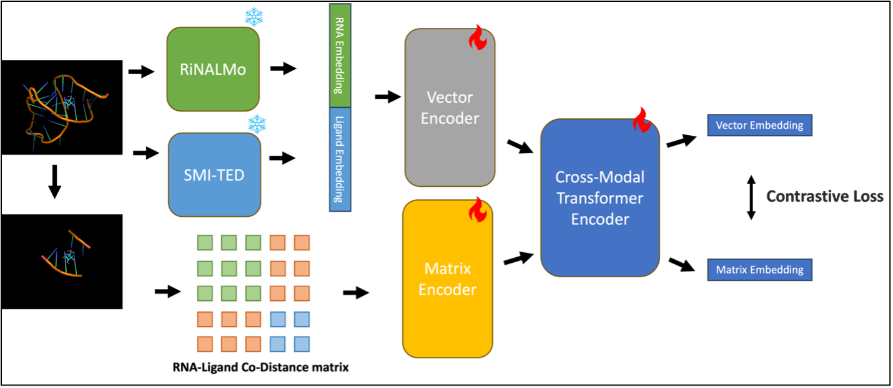
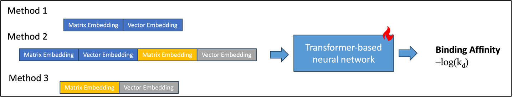

# Cross-Domain Multimodal Contrastive Learning for RNA-Ligand Binding Affinity Prediction


## Overview

Expanding drug targets to RNA offers vast therapeutic potential, but RNA-ligand binding prediction remains underexplored due to limited datasets and the complexity of RNA structures.  
This repository implements a **cross-domain multimodal contrastive learning pipeline** for **RNA-ligand binding affinity prediction**, combining interaction-free RNA and ligand sequence embeddings with structural (pocket) information, and pretraining a foundation model using a CLIP-style contrastive objective. The pretrained model can be fine-tuned for downstream regression tasks.

**Key features:**
- Integrates both sequence-based (RNA/ligand) and structure-based (binding pocket) representations
- Leverages large-scale language models (RiNALMo, SMI-TED) for sequence embeddings
- Incorporates 3D atomic pairwise co-distance matrices for pocket-structure context
- Modular code for pretraining, fine-tuning, and inference


## Methods (Summary)

- **Dataset preparation:**  
  PDBbind v2020 dataset were processed to extract high-quality RNA-ligand complexes, with structure-based clustering ([RMalign](https://github.com/LinTzuTang/RMalign)) for robust data splits.
- **Sequence encoding:**  
  - **RNA:** Embeddings from [RiNALMo](https://github.com/lbcb-sci/RiNALMo) (650M parameters, 36M ncRNA), 1280d
  - **Ligand:** SMILES embeddings from [SMI-TED](https://github.com/IBM/materials) (768d)
- **Structure encoding:**  
  - Pairwise co-distance matrices (pocket + ligand atoms), fixed 621x621 size  
- **Model:**  
  - Vector Encoder (for sequence), Matrix Encoder (for structure), and Cross-Modal Transformer Encoder
  - Contrastive loss to align sequence-structure pairs during pretraining
  - Downstream Transformer for binding affinity regression
- **Baselines:**  
  Retrained RLaffinity, GIGN transfer learning; new model outperforms both (Test RMSE ~1.8 vs ~1.9)

See full method details in [the original PDF](./docs/Cross-Domain%20Multimodal%20Contrastive%20Learning%20for%20RNA-Ligand%20Binding%20Affinity%20Prediction.pdf) and [the report slides](./docs/RNA-ligand%20binding%20affinity%20prediction%20slides.pdf)

1. Pretrain Model Architecture  



2. Fine-Tuning settings for binding affinity prediction  




## Code Modules

```
CoRSA/
├── data_process.py # Process RNA-Ligand binding data
├── seq_encoding.py # Sequence-based tokenization, embedding utilities
├── str_encoding.py # Structure-based feature encoding utilities
├── pretrain.py # Pretraining (contrastive learning, CLIP-style loss)
├── finetune.py # Fine-tuning and evaluation 
```